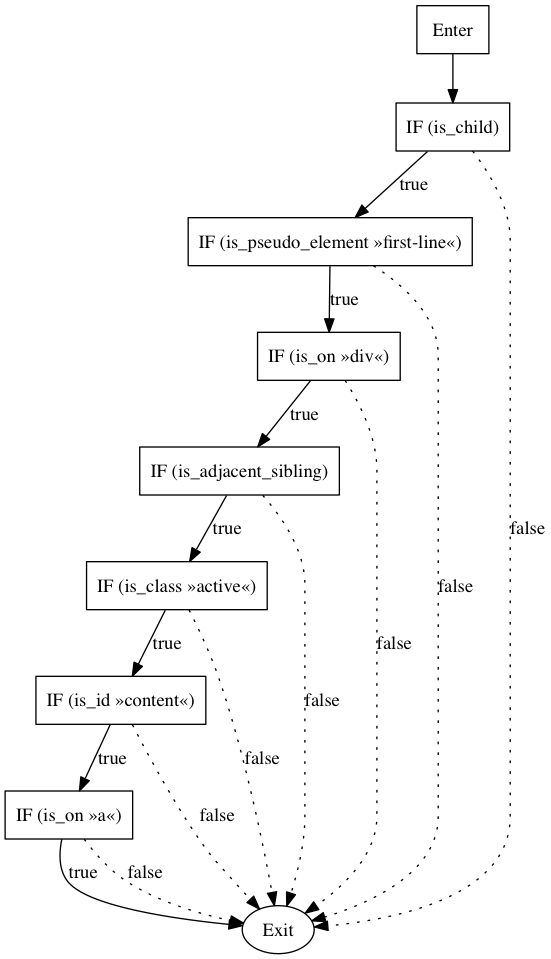

# CSSplexity Visualization

> A simple tool to visualize the cyclomatic complexity of CSS selectors based on CSSplexity

[](https://travis-ci.org/rasshofer/cssplexity-visualization)
[](https://david-dm.org/rasshofer/cssplexity-visualization)

## Installation

1. Install [GraphViz](http://www.graphviz.org/) to generate the visual graphs
   - Mac OS X: `brew install graphviz` / `port install graphviz`
   - Debian/Ubuntu: `apt-get install graphviz`
2. Clone this repository
3. Run `npm install`
4. Run `node visualize "{YOUR SELECTOR}" | dot -Tpng > {GRAPH FILENAME}.png`

## Example

```sh
node visualize "a#content.active > div::first-line [data-content]" | dot -Tpng > example.png
```



## Changelog

* 0.0.5
  * Update outdated dependencies
* 0.0.4
  * Add tests
* 0.0.3
  * Update CSSplexity
* 0.0.2
  * Update CSSplexity
  * Highlight 'Enter' and 'Exit' nodes visually
  * Fix graph generation for subject-only selectors
* 0.0.1
  * Initial version

## License

Copyright (c) 2016 [Thomas Rasshofer](http://thomasrasshofer.com/)  
Licensed under the MIT license.

See LICENSE for more info.
